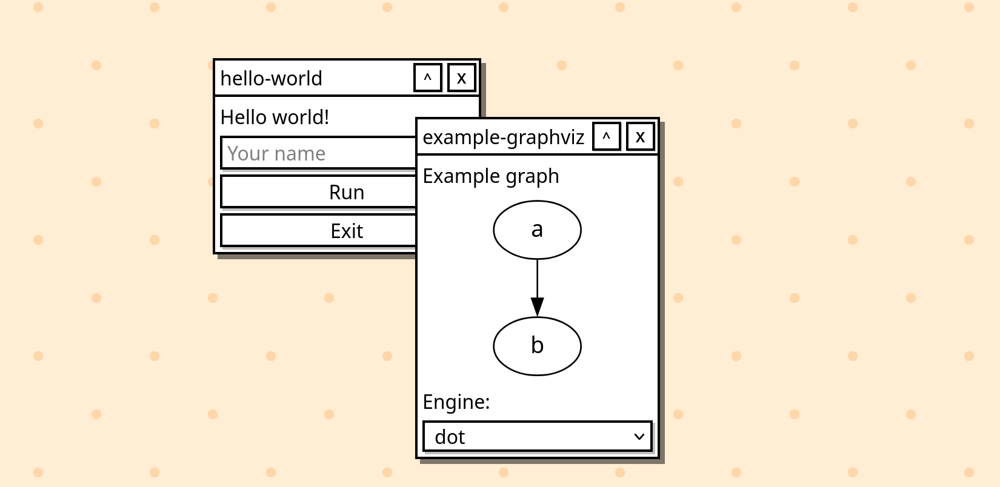

# Weird - a gui protocol, i think

**Weird** is a small client/server protocol for making simple GUIs, especially developer tools.

At the moment, it's still very much just a proof-of-concept!



## try it out

First, run the server:

```sh
cargo run
```

Next, start the web interface:

```sh
cd weird-web
npm run dev
```

Navigate to the frontend URL in your browser (default: <http://localhost:5173>) to access the web interface. It'll be mostly empty until something renders to it.

Finally, run apps to connect to the server. Once an app starts, it'll show a window in the web interface!

```sh
cargo run -p hello-world
```

## hello world

Rust (using `weird-client` and `weird-core` crates from this repo):

```rust
use weird_client::WeirdClient;
use weird_core::world::Node;

fn main() {
    // Connect to the weird server
    let weird = WeirdClient::builder().app("hello-world").connect().unwrap();

    // Basic event loop: render UI, handle user action, repeat
    loop {

        // Render our window
        weird.render([
            Node::text("Hello, world!"),
            Node::element("Button").id("exit").child(Node::text("Exit")),
        ]);

        // Wait until we get an event from the UI
        let Some(event) = weird.next_event().unwrap() else {
            // ...or exit e.g. if the server exits, window closes, etc.
            println!("Exited (channel closed)");
            break;
        };

        // Handle the event
        if event.is("exit", "click") {
            println!("Exited after clicking 'Exit' button");
            break;
        } else {
            // Unhandled event
        }

    }
}
```

## architecture

The core pieces are:

- `weird-server`: Listens on a Unix socket for local apps, and on a WebSocket for the web UI. Holds the state of the UI and sends events to/between clients.
- `weird-client`: A library for apps to interact with the server and render UIs.
- `weird-web`: A web frontend that connects to the server and renders the UI in your browser.

The protocol uses [JSON-RPC](https://www.jsonrpc.org/specification) between the clients and server[^jsonrpc] (newline-delimited), so it should be pretty easy to integrate from ~any language. Also, the protocol itself is network-transparent, so it should be possible to use over the network, or over a serial connection, etc.

The UI is structured very similar to the HTML DOM: it's made of a tree of element nodes (tag, attributes, child nodes) and text nodes. Elements can emit events for apps to handle, like the `click` event when a user clicks on a button, `change` when the user updates an input, etc.

Weird _doesn't_ support arbitrary HTML elements. Intstead, the client supports a useful set of higher-level component elements: think things like `ProgressBar`, `Graphviz`, `ModalDialog`, `TextEditor`, etc (since it's still a proof-of-concept, there aren't very many elements yet!). Styling is still an open question, but it probably won't be full-blown CSS.

Oh, and the current frontend is a webapp (`weird-web`), but the goal is to be flexible enough to support frontends for other targets: GTK, Qt, Wayland, X11, Win32, Cocoa, etc. Maybe even a frontend that renders as a TUI?

## theory & motivation

When working on projects, I really get the itch to interact with things. I want to poke around with things, to play around with it, to see if it works and how it works, etc.

In frontend webdev, every browser includes a **Web Inspector**, which is super nice to poke around on a webpage in real time-- viewing and editing the DOM, previewing style changes, viewing network requests, etc. Similarly, most off-the-shelf game engines have a **scene editor**, which (usually) works while the game is running! Very similar idea: you can view and edit objects in the game world, etc.

These are _prebuilt tools_, which are definitely amazing for what you get, but building good tooling like that is... difficult!

In the gamedev world (mainly), there's [Dear ImGui](https://github.com/ocornut/imgui), which is a UI framework that makes it very easy to write _custom tools_. You just need a place to render the output to (and if you're making a game or game engine, you've already got that!). I really like the idea of making it easy to make little dev tools!

---

Professionally, I mostly do backend webdev. I also work on various open-source projects and tooling ([Brioche](https://brioche.dev/), etc.). Most of my projects are things where Dear ImGui don't really fit well (since I neither have a render target nor a continuous event loop)... so what options do I have for making little tools myself?

- **TUIs** ([Ratatui](https://ratatui.rs/), [Bubble Tea](https://github.com/charmbracelet/bubbletea), many others)
    - Basically standard practice, but mostly restricted to the capabilities of [80's-era hardware](https://en.wikipedia.org/wiki/VT220) (something exotic like "showing an image" is basically doable nowadays, but the whole UI is still constrainted to a fixed character grid).
- **Debuggers** (gdb, lldb, etc.)
    - Good for digging into low-level problems, but bad for inspecting a system at a high level. Can write custom visualizers via Python or whatever, but I think that's a lot of friction!
- **Desktop UI frameworks** (GTK, Qt, Win32, Cocoa, Electron, whatever)
    - Most are pretty heavy-handed and more meant for full-on apps, and generally hard to adapt for an existing project for small dev tools (not to mention build-time dependencies, cross-platform challenges, etc.).
    - There are some standouts though! Some frameworks like [iced](https://iced.rs/) seem like they _would_ work pretty well for building small dev tooling
- **API w/ web frontend**
    - I actually like working with React-style frontend frameworks... but building an API is a chokepoint for working on little tools! System changes send ripples between the backend, API schema, and frontend, which really slows down how quickly you can iterate on tooling.

---

This is where Weird comes in. It's meant to be simple to add to an existing project and simple to build useful tools. It's a "terminal competitor", in that it should be nearly frictionless to get off the ground. Similarly, Weird's goal is to span from "hello world" to developer powertools, but _not_ aiming for general-purpose applications.

## ambitions

Some fuzzy ideas I have for Weird:

- **Accessibility**: I think the core idea lends itself _much_ better to accessibility than TUIs. We get to tap into that a bit today from the web frontend, but there's still lots to prove out here.
- **Keyboard-focused**: I believe one of the reasons the terminal and TUIs are so prominent today is it's keyboard-first, which can be much faster to work with for power users. I'd really like to build Weird so both the keyboard and mouse each feel first-class.
    - Make it easy for apps to use custom keybindings.
    - Keyboard-based window management.
    - A top-level command palette / command prompt.
- **System shell**: Taking "terminal replacement" to the extreme, Weird could have a shell of some sort
    - Maybe this is just a normal Weird app? i.e. renders a Weird UI, then does normal shell-like things within Weird.
    - Maybe this is something the frontend should handle directly? This would be do-able if the core protocol exposed shell-style methods (spawn a program, read/write files, etc).
    - Also relevant with building things with a keyboard focus.
- **Remote connections**: It'd be cool to connect to a remote server and use a Weird-based app directly!
    - How does this work architecturally? Can a frontend access a remote server? Or do both sides have their own servers that talk to each other?
    - Today, several pieces assume low-latency connections (e.g. `Input`: it triggers a `change` event and assumes the app will re-render with the updated `value` attribute quickly). For remote connections, we'd want to think about high-latency connections
- **Custom components**: Might be useful to have some way to provide custom components, which downstream apps can treat as native elements.
- **Client-side apps**: Right now, apps run externally from the frontend. But with the web frontend for example, we could easily run apps compiled for WebAssembly directly in the browser. With this model, apps would be portable, cross-platform, and really easy to sandbox. I think it's kind of a neat idea, but not really sure how useful this is.
- **Styling**: We definitely need some styling support: spacing, button colors, sizes for elements like images, etc.
    - I like having some simple container elements for basic layout like `Row`, `Column`, `Grid`, etc.
    - I really like working with Tailwind. The current design I'm thinking about is a `style` attribute for inline styles, but with terse syntax that feels more Tailwind-like. We can still cascade down styles like `color`, `font-size`, etc.

[^jsonrpc]: The server can send multiple response messages for a single request ID, for subscriptions and streaming responses. The JSON-RPC spec doesn't seem to make any affordances for this, so I think we may not actually be in compliance with the spec to be honest! ¯\\\_(ツ)_/¯
